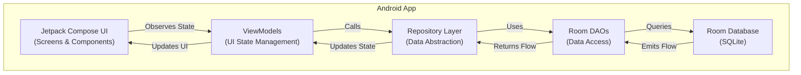

# Book Tracking App Architecture Document

## Introduction

### Introduction Content

This document outlines the overall architecture for the Book Tracking App, an Android mobile application that enables users to track books they've read, rate them 1-5 stars, and maintain a reading list. The architecture is designed for a mobile-first experience with local data storage, focusing on simplicity, performance, and maintainability.

**Architecture Approach:**
This is a native Android application built with Kotlin and Jetpack Compose. The architecture follows Android's recommended MVVM (Model-View-ViewModel) pattern with a local Room database for data persistence. No backend services are required for the MVP, keeping the architecture lean and focused on the mobile experience.

### Starter Template or Existing Project

**Status:** Existing Android project with basic setup

**Analysis:**
- **Existing Setup:** The project is already initialized as an Android app using Kotlin and Jetpack Compose
- **Current Configuration:**
  - Kotlin with Android Gradle Plugin
  - Jetpack Compose enabled
  - Material 3 UI library
  - Target SDK 36, Min SDK 24
  - Lifecycle and Activity Compose dependencies already configured

**Architectural Decisions:**
- Building upon the existing Android Compose setup
- Adding Room database for local storage
- Implementing MVVM architecture pattern
- No additional starter templates needed - leveraging Android's native architecture components

### Change Log

| Date | Version | Description | Author |
|------|---------|-------------|---------|
| 2024-12-28 | 1.0 | Initial architecture document | Architect |

## High Level Architecture

### Technical Summary

The Book Tracking App follows a native Android architecture pattern using MVVM (Model-View-ViewModel) with Jetpack Compose for the UI layer and Room database for local data persistence. The architecture is designed as a single-activity application with Compose navigation, following Android's recommended practices for modern Android development. The app uses Kotlin coroutines and Flow for asynchronous operations and reactive data streams, ensuring smooth UI updates and efficient data handling. All data is stored locally using Room, eliminating the need for backend services and providing offline-first functionality. This architecture supports the PRD goals of tracking books, ratings, and reading lists while maintaining simplicity and performance.

### High Level Overview

**Architectural Style:** Native Android Mobile Application with Local-First Architecture

1. **Main Architectural Style:** Single-activity application pattern with MVVM architecture. All data operations are local-first with no network dependencies, ensuring the app works entirely offline.

2. **Repository Structure:** Single Android app module (Monolith) - No polyrepo structure needed as this is a standalone mobile application.

3. **Service Architecture:** Single-activity architecture using Jetpack Compose. The app is self-contained with no microservices or distributed services - all functionality exists within the Android application.

4. **Primary User Interaction Flow:** 
   - User opens app → Views main screen (lists of read books and reading list)
   - User can add a book to reading list or mark as read
   - User can rate books (1-5 stars) when marking as read
   - All data persists locally in Room database
   - UI updates reactively through ViewModel observing database changes

5. **Key Architectural Decisions:**
   - **MVVM Pattern:** Separation of concerns with ViewModels managing UI state and business logic, Views (Compose) handling UI rendering
   - **Room Database:** Local SQLite database with Room ORM for type-safe data access
   - **Jetpack Compose:** Modern declarative UI framework for reactive UI updates
   - **Kotlin Coroutines & Flow:** For asynchronous operations and reactive data streams
   - **Single Source of Truth:** Database as the single source of truth, with ViewModels observing database changes
   - **Offline-First:** No network dependencies, all operations work offline

### High Level Project Diagram

### Architectural and Design Patterns

- **MVVM (Model-View-ViewModel):** Separation of UI (Compose Views) from business logic (ViewModels) and data (Room Database). ViewModels manage UI state and handle user actions, while Views observe state and render UI reactively. _Rationale:_ Android's recommended architecture pattern, provides testability, maintains separation of concerns, and works seamlessly with Jetpack Compose.

- **Repository Pattern:** Abstraction layer between ViewModels and data sources (Room database). Repositories handle data operations and provide clean APIs for ViewModels. _Rationale:_ Enables easier testing by allowing ViewModels to be tested independently of database implementation, provides flexibility for future data source changes (e.g., adding cloud sync), and centralizes data access logic.

- **Single Source of Truth (Database):** Room database serves as the single source of truth for all app data. ViewModels observe database changes through Flow and update UI reactively. _Rationale:_ Ensures data consistency across the app, eliminates state synchronization issues, and provides automatic UI updates when data changes.

- **Observer Pattern:** ViewModels observe database changes using Kotlin Flow, enabling reactive UI updates. _Rationale:_ Leverages Kotlin's reactive programming capabilities, provides automatic UI updates without manual refresh, and aligns with Android's modern data flow patterns.

